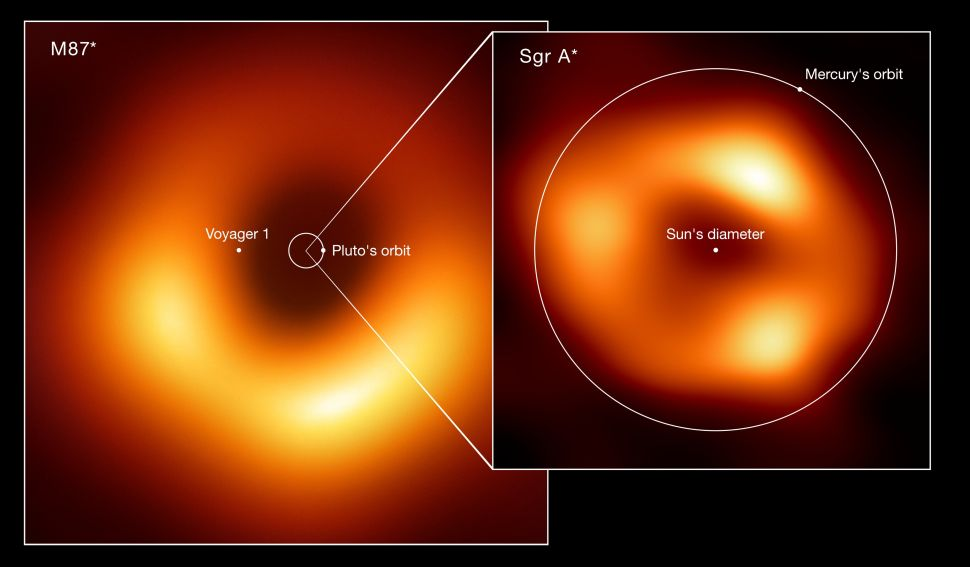
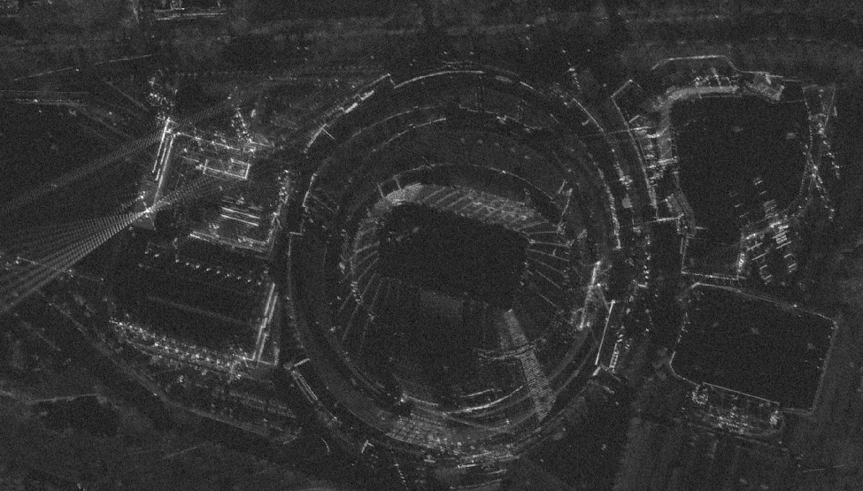
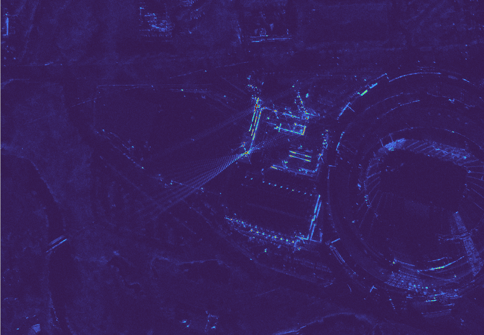
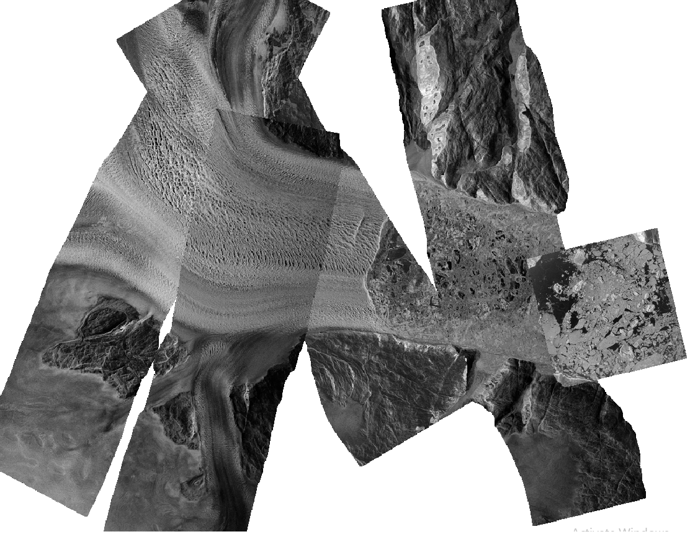

# SAR_Imaging
**Ongoing research**
## Outline
Research collected on synthetic aperature radar for reference. Record the research process and develop a comprihensive summary of SAR remote sensing for use in the future. 

## General Info
info draft: 

*"Remote sensing is the process of detecting and monitoring the physical characteristics of an area by measuring its reflected and emitted radiation at a distance (typically from satellite or aircraft)."*

Optical remote sensing is done by *passively*[1](#1) capturing only the radiation with a wavelength that falls within the visible spectrum. Optical satellite imagery offers numerous benefits in regards to image resolution[2](#2), and is relied on by a wide variety of applications requiring geological observation. This process, however, requires certain strict environmental conditions to be met to yield usable data. Environmental conditions such as cloud cover, atmospheric debris, or lack of reflected radiation (A.K.A. any observations made at nighttime) would all present impassable scenarios preventing the capture of usable imagery. Images from optical remote sensors need little post-processing and still tend to be more easily recognizable than other forms of remote sensing due to their familiar format. But unfortunate environmental constraints limit the potential uses of optical sensors to provide up-to-date imagery at a moment's notice.

Microwave radar is collected *actively*[1](#1) through the emission and capture of reflected energy with wavelengths that fall, *very surprisingly*, within the microwave spectrum. The conditional requirements for this mode of data collection are much less environmentally dependent. However, this form of remote sensing dictates by nature that the resolution of any image collected is largely dependent on the size of the aperature used to collect it. Meaning that without the presence of an astronomically large aperature. (Such as the one synthesized to collect images of the accretion disk surrounding the event horizon of the black hole at the center of the Milky Way (26,000 light-years away from earth) , [Sagittarius A](https://www.space.com/meet-milky-way-black-hole-sagittarius-a))

* **

**Pause for interesting rabit hole.**

The same process used to collect and visualize data of Sagittarius A was first conducted on Messier 87, another black hole at the center of the Virgo Cluster. An image of the visualizations is included below. The ring around the perimeter and the centrally placed white dot in the image of Sgr. A represent a rough approximation of Mercury's orbit and the Sun's diameter respectively. The small ring and white dot in the image of M87 however, represents the ***the entire approximated ellipsal orbit of pluto, and the distance covered by Voyager 1 over the entirety of its journey to interstellar space since it's launch on September 5th, 1977.*** 

M87-left / Sagittarius A-right
 
 

* ** 
*"SAR [Synthetic Aperture Radar] is a type of active data collection where a sensor produces its own energy and then records the amount of that energy reflected back [to the sensor] after interacting with the Earth."*(Herndon) 

NASA definition of SAR: 
Synthetic Aperature Radar data is gathered with the use of microwave emitters and recievers that are refered to as remote sensors. These remote sensors collect data from the target by emitting radio waves towards an area (Lat. & Long. bracketing defined by the user). The radio waves reflect off the user-defined area and are recieved by the satelite.  

The reciever records multiple attributes of the microwaves reflected from the the target surface. It is these attributes that can be manipulated in the image processing stage to reveal information about the target surface that typical optical imagery cannot gather. 

#### 1: 
Passive remote sensing collects radiation produced by other objects that is reflected from the target area.
Active remote sensing emits its own energy and collects the energy reflected from the target area.

#### 2:
For this application, resolution can be defined as the finest amount of detail that still enables the user to distinguish between two distant objects. This is measured in meters. (ex: image y has a resolution of 10 meters, two different objects sitting in close proximity to one another with measurements of 10m x 10m can be differentiated)

 Follow this [link](http://www.edc.uri.edu/nrs/classes/nrs409/rs/lectures/howremotesensonwork.pdf) for an excellent presentation regarding spacial resolution. 

### **Information on Capella Space Imagery**
***"Capella Space specializes in the delivery of up-to-date information at the moment it is needed most. Access to live satelite imagery regardless of environmental factors is vital to make decison that save human life."***

Information is collected by a constellation of 6 active satellites that can provide geological imagery scans updated by the hour.

* **
## Exploration

Begin by first collecting data from open s3 bucket and visualize using OSGeo

Outline deployed tech and gather credentials.
Amazon AWS CLI 
Amazon S3 
OSGeo

Use credentials to download data from Capella Space's s3 bucket

Open data in GEO.tif format 

Visualize remotely sensed imagery

Citations:

Herndon, K., Meyer, F., Flores, A., Cherrington, E., &amp; Kucera, L. (n.d.). *What is Synthetic Aperture Radar?* Earth**data**. Retrieved August 21, 2022, from https://www.earthdata.nasa.gov/learn/backgrounders/what-is-sar 

Capella Space Synthetic Aperture Radar (SAR) Open Dataset was accessed on 8/14/2022 from https://registry.opendata.aws/capella_opendata.
